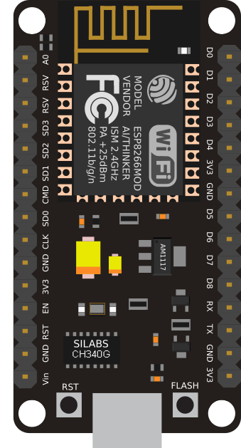
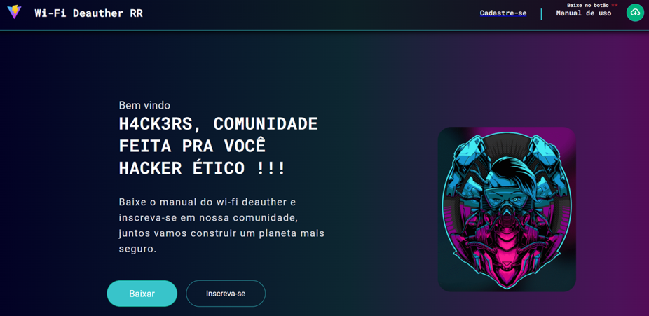
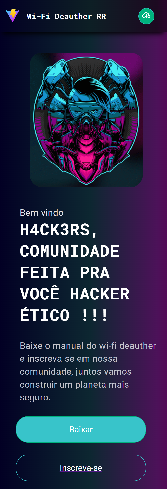

<p align="center">  Site RR-Deauther 🚀</p>

<p align="center">
   
</p>

<p align="center">	
   <a href="https://www.linkedin.com/in/lorison-gilles/">
      
   </a>
  

  <a href="https://github.com/Gilles30/wifi-deauther/commits/master">
    
  </a> 
  
  <a href="https://github.com/Gilles30/wifi-deauther/stargazers">
    
  </a>
</p>

> <p align="center"> :rocket: Project created in carrying out a skill test with web development </p>

<p align="center">
    <a href="README.md">English</a>
    ·
    <a href="README-pt.md">Portuguese</a>
 </p>

<div align="center">
  <sub>RR WiFi-Deauther. Construído com ❤︎ por
    <a href="https://github.com/Gilles30">Lorison Gilles</a> e
    <a href="https://github.com/Gilles30/wifi-deauther/">
      contribuidores.
    </a>
  </sub>
</div>

# :pushpin: Indice

- [:pushpin: Indice](#pushpin-indice)
    - [Web Screenshot](#web-screenshot)
    - [Mobile Screenshot](#mobile-screenshot)
- [:eyes: Demo Website](#eyes-demo-website)
- [:computer: Tecnologias](#computer-tecnologias)
- [:rocket: Recursos](#rocket-recursos)
- [:construction_worker: Como rodar](#construction_worker-como-rodar)
    - [📦 Rodar EmailJS](#-rodar-emailjs)
    - [💻 Rodar Projeto Web](#-rodar-projeto-web)
- [Go to web folder](#go-to-web-folder)
- [Install Dependencies](#install-dependencies)
- [Run Aplication](#run-aplication)
- [:bug: Problemas](#bug-problemas)
- [:tada: Contribuindo](#tada-contribuindo)
  - [🤝 Contribuindo](#-contribuindo)
- [:closed_book: Licenca](#closed_book-licenca)

</p>

### Web Screenshot

<div align="center">
   
   </br></br>
   <!-- 
   </br></br> -->
   <p>
   O site foi elaborado para captura de email e para disponibilizar um manual de uso em PDF do wifi deauther feito por mim.
   </p>
   
   <p>
    O site foi elaborado utilizando algumas das mais atuais tecnologias no desenvilvimento web, foi utilizado uma biblioteca para manipulação no envio do email, utilizado GTM e Google Analytics para desenvolvimento pessoal.
   </p>
   </br></br>
   
   <p>
    Foi uma interface moderna e com tema mais escuro com base no gosto e preferencias dos devs / hackers.
   </p>
   
</div>
</br>

### Mobile Screenshot

<div align="center">
  
  </br></br>
</div>

# :eyes: Demo Website

Você pode acessar o site deployado clicando no icone abaixo:
👉 demo:

[](https://wifi-deauther.vercel.app/)

# :computer: Tecnologias

Este projeto foi feito utilizando as seguintes tecnologias:

- [Typescript](https://www.typescriptlang.org/)
- [Prettier](https://prettier.io/)
- [React](https://reactjs.org/)
- [Styled-Components](https://www.styled-components.com/)
- [EmailJS](https://www.emailjs.com/)
- [Vite](https://vitejs.dev/)
- [GoogleTagManager](https://marketingplatform.google.com/about/tag-manager/)
- [ReactForms](https://reactjs.org/docs/forms.html)

# :rocket: Recursos

- Download de PDF.
- Formulario de inscrição
- Envio e recebimento de e-mail.
<!-- - API para consumo de dados. -->

# :construction_worker: Como rodar

```bash
# Clonar o repositório
$ git clone https://github.com/Gilles30/wifi-deauther.git
```

### 📦 Rodar EmailJS

- A configuração foi feita no email do desnvolvedor, sendo ocultado parte no código, com isso o download desse repositório pode não funcionar corretamente!
<!--

````bash
# Routes and Endpoint
$ api-sure.herokuapp.com/data

# Object Typing
$ Data:{
  nodes
    {
      name: string,
      shortDescription: string
      id: string
      images:
        [
          {
            alt: string
            src: string
          }
        ]
      category:
        [
          name: string
          id: string
        ]
    }
  }
``` -->
<!--
Access API at http://api-sure.herokuapp.com/data
Link repo Github: https://github.com/Gilles30/api-sure -->

### 💻 Rodar Projeto Web

```bash
# Go to web folder
$ cd wifi-deauther

# Install Dependencies
$ yarn

# Run Aplication
$ yarn dev

````

Go to http://localhost:3002

# :bug: Problemas

Sinta-se à vontade para **arquivar uma nova edição** com o respectivo título e descrição no repositório [Proffy](https://github.com/Gilles30/wifi-deauther.git/issues). Se você já encontrou uma solução para o seu problema, **eu adoraria analisar sua solicitação de pull**!

# :tada: Contribuindo

Confira a página [contribuindo](./CONTRIBUTING.md) para ver os melhores lugares para arquivar problemas, iniciar discussões e começar a contribuir.

## 🤝 Contribuindo

Siga os passos abaixo para contribuir:

1.  _fork_ o projeto (<https://github.com/Gill3s0x01/wifi-deauther.git>)

2.  Clone seu _fork_ para sua máquina (`git clone https://github.com/Gilles30/wifi-deauther.git`)

3.  Crie um _branch_ para realizar sua modificação (`git checkout -b feature/name_new_feature`)

4.  Adicione suas modificações e faça o _commit_ (`git commit -m "Descreva sua modificação"`)

5.  _Push_ (`git push origin feature/name_new_feature`)

6.  Crie um novo _Pull Request_

7.  Pronto, agora é só aguardar a análise 🚀

# :closed_book: Licenca

Lançado em 2022 :closed_book: Licença

Feito com amor por [Gill3s0x01](https://github.com/Gill3s0x01) 🚀.
Este projeto está sob a [MIT license](./LICENSE).

Dê um ⭐️ se esse projeto te ajudou!
